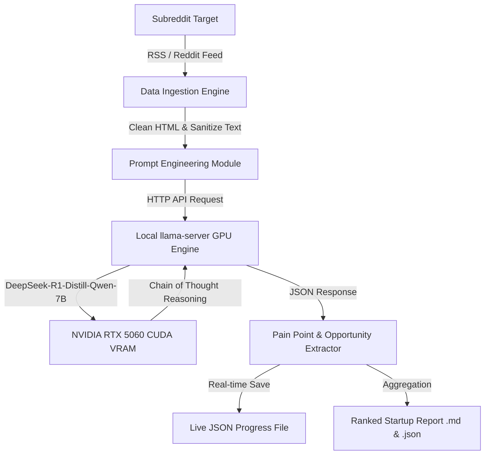

# 🚀 Subreddit Developer Pain Point & SaaS Opportunity Miner

> **Powered by Local DeepSeek-R1 GPU Inference (CUDA 12.8 / RTX 5060)**  
> Automatically mine developer pain points, unfulfilled feature requests, and validated SaaS startup opportunities from any subreddit.

---

## 📌 Architecture Overview



---

## 🔥 Key Features

- **🧠 DeepSeek-R1 Chain-of-Thought:** Uses local DeepSeek-R1 reasoning (`<think>`) to analyze complex technical complaints and extract root-cause developer frustrations.
- **💸 100% Free & Local:** Runs on local GPU via CUDA `llama-server`. No OpenAI/Claude API subscription fees.
- **🎯 Any Subreddit Target:** Effortlessly switch between `r/devops`, `r/LocalLLaMA`, `r/LangChain`, `r/webdev`, `r/ecommerce`, etc.
- **📊 Automatic Categorization & Severity Scoring:** Classifies pain points into categories (*"GPU Memory Leaks"*, *"CI/CD Pipeline"*, *"Boilerplate & Config"*) with severity ratings (*Critical*, *Moderate*, *Minor*).
- **⚡ Live Progress Streaming:** Outputs live progress updates into `deepseek_r1_painpoints_live.json` after every single post.

---

## 🛠️ Installation & Setup

### 1. Prerequisites
- Python 3.10+
- NVIDIA GPU with 6GB+ VRAM (e.g. RTX 3060, RTX 4060, RTX 5060)
- PyTorch with CUDA support

### 2. Clone & Install Dependencies
```bash
git clone https://github.com/your-username/subreddit-pain-point-miner.git
cd subreddit-pain-point-miner
pip install requests feedparser
```

### 3. Start Local DeepSeek-R1 GPU Server
Download the 4-bit quantized GGUF weights (`DeepSeek-R1-Distill-Qwen-7B-Q4_K_M.gguf`) and launch `llama-server.exe`:

```powershell
./llama-bin/llama-server.exe -m "path/to/DeepSeek-R1-Distill-Qwen-7B-Q4_K_M.gguf" -ngl 99 --port 8080
```

---

## 🚀 Usage Guide

### Run Pain Point Extraction CLI

```bash
# Mine 100 latest posts from r/devops
python pain_point_miner.py --subreddit devops --limit 100 --comments 5

# Mine 50 latest posts from r/LocalLLaMA
python pain_point_miner.py --subreddit LocalLLaMA --limit 50 --comments 5

# Mine hot posts from r/LangChain
python pain_point_miner.py --subreddit LangChain --limit 50 --sort hot
```

---

## 🧠 Prompt Engineering Strategy

DeepSeek-R1 is prompted with a specialized **SaaS Venture Capitalist & Developer Tooling Researcher** persona:

```json
{
  "has_pain_point": true,
  "pain_category": "CI/CD & Security",
  "problem_statement": "Agents in CI/CD pipelines access sensitive secrets prior to redaction.",
  "severity": "Critical",
  "startup_opportunity": "An inline secret redaction proxy for CI/CD runners before agent execution."
}
```

---

## 📄 Output Reports

All generated reports are saved automatically to the `reports/` folder:
- **Markdown Report (`.md`):** Executive summary, category breakdown matrix, and ranked startup ideas.
- **JSON Data Export (`.json`):** Machine-readable structured database of all analyzed discussions.

---

## 📄 License
Apache 2.0 License. Free to use for personal and commercial SaaS research.
